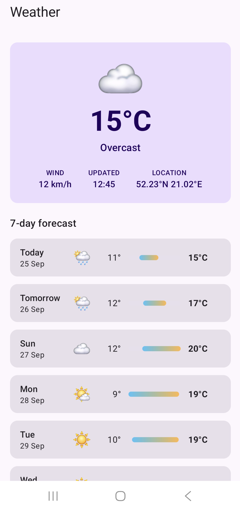
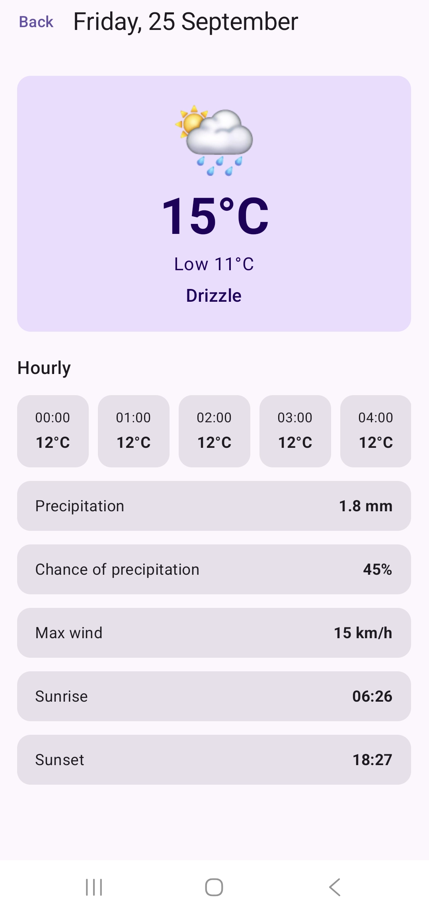
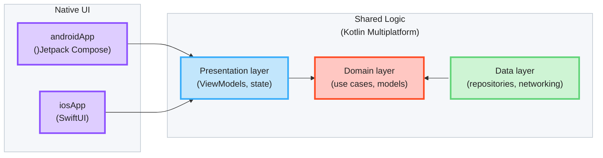

# 💎 KMP Showcase

A [Kotlin Multiplatform](https://www.jetbrains.com/help/kotlin-multiplatform-dev/get-started.html) sample application 
demonstrating how to share code for Android and iOS. The data, domain and presentation logic live in a common Kotlin 
module, the UI is native on each platform.

- [💎 KMP Showcase](#-kmp-showcase)
  - [Application Scope](#application-scope)
  - [Tech-Stack](#tech-stack)
  - [Architecture](#architecture)
    - [Feature Module Structure](#feature-module-structure)
      - [Presentation Layer](#presentation-layer)
      - [Domain Layer](#domain-layer)
      - [Data Layer](#data-layer)
      - [Common Module Components](#common-module-components)
  - [Getting Started](#getting-started)
  - [Design Decisions](#design-decisions)
    - [UI State Management via Flow MVI](#ui-state-management-via-flow-mvi)
      - [Consuming Common ViewModels](#consuming-common-viewmodels)
      - [Shared Store Setup](#shared-store-setup)
    - [Convention Plugins](#convention-plugins)
    - [Feature UI Lives in the Feature Module](#feature-ui-lives-in-the-feature-module)
    - [Navigation](#navigation)
  - [Dependency Injection](#dependency-injection)
  - [Caching](#caching)
  - [Naming Conventions](#naming-conventions)
    - [Screens vs Components](#screens-vs-components)
  - [Linters](#linters)
  - [CI-Pipeline](#ci-pipeline)
  - [Debugging FlowMVI](#debugging-flowmvi)

## Application Scope

A weather app built with KMP that displays weather for current week and each day sourced from the 
[Open-Meteo API](https://open-meteo.com/). The application demonstrates real-world scenarios including network requests, 
local caching, navigation, and state management.

**Features:**
- **Weekly Forecast** - display weekly weather forecast with daily summary and temperature range; pull to refresh
- **Daily Forecast** - display detailed daily weather forecast with hourly temperature and precipitation

<p>
  
  
</p>

## Tech-Stack

Built with modern Kotlin Multiplatform tools and libraries, prioritizing code sharing, native UI on each platform,
project structure stability and production-readiness.

**Core Technologies:**
- **[Kotlin](https://kotlinlang.org/)** - Modern, expressive programming language
  - **[Kotlin Multiplatform](https://kotlinlang.org/docs/multiplatform.html)** - Share data, domain and presentation logic between Android and iOS
  - **[Coroutines](https://kotlinlang.org/docs/coroutines-overview.html)** - Asynchronous programming
  - **[Flow](https://kotlinlang.org/docs/flow.html)** - Reactive data streams
  - **[Serialization](https://kotlinlang.org/docs/serialization.html)** - JSON parsing
  - **[kotlinx-datetime](https://github.com/Kotlin/kotlinx-datetime)** - Multiplatform date and time

**Kotlin-Swift Interop:**
- **[SKIE](https://skie.touchlab.co)** - Kotlin Native compiler plugin that improves Kotlin-Swift interoperability
  (`Flow` → `AsyncSequence` / `Observing`, `sealed class` → exhaustive Swift enum (`onEnum(of:)`), `suspend` → `async`,
  default arguments, etc.)
- **[KMP-ObservableViewModel](https://github.com/rickclephas/KMP-ObservableViewModel)** - Share Kotlin ViewModels
  between Android and iOS. Makes Kotlin state changes observable by SwiftUI and clears `viewModelScope` when the view
  goes away

**Presentation:**
- **[FlowMVI](https://github.com/respawn-llc/FlowMVI)** - MVI framework (state, intents, actions, plugins)
- **[AndroidX ViewModel](https://developer.android.com/topic/libraries/architecture/viewmodel)** - Multiplatform
  lifecycle-aware ViewModel

**Android UI:**
- **[Jetpack Compose](https://developer.android.com/jetpack/compose)** - Declarative UI framework
- **[Material Design 3](https://m3.material.io/)** - Design system
- **[Navigation 3](https://developer.android.com/guide/navigation/navigation-3)** - Back stack based navigation with
  ViewModels scoped to back stack entries

**iOS UI:**
- **[SwiftUI](https://developer.apple.com/xcode/swiftui/)** - Declarative UI framework
- **[NavigationStack](https://developer.apple.com/documentation/swiftui/navigationstack)** - Value-based navigation

**Networking:**
- **[Ktor Client](https://ktor.io/docs/client-create-and-configure.html)** - Multiplatform HTTP client (Android engine on
  Android, Darwin engine on iOS)
  - **[Ktor Resources](https://ktor.io/docs/client-resources.html)** - Type-safe HTTP requests. A `@Resource` request
    class (e.g. `ForecastRequestModel`) is serialized into the URL path and query parameters, so no manual `append(...)`
  - **[Content Negotiation](https://ktor.io/docs/client-serialization.html)** - JSON (de)serialization with
    kotlinx.serialization

**Dependency Injection:**
- **[Koin](https://insert-koin.io/)** - Lightweight multiplatform dependency injection framework

**Architecture:**
- **[Clean Architecture](https://blog.cleancoder.com/uncle-bob/2012/08/13/the-clean-architecture.html)** - Separation
  of concerns with defined layers
- **MVVM + MVI** - Shared ViewModels exposing a single UI state
- **Shared logic, native UI** - Data, domain and presentation in Kotlin; Jetpack Compose and SwiftUI screens
- **Modular Design** - Feature-based modules for scalability

**Testing:**
- **[kotlin-test](https://kotlinlang.org/api/core/kotlin-test/)** - Multiplatform test library (`commonTest`, Android
  host tests, iOS simulator tests)

**Code Quality:**
- **[Ktlint](https://github.com/pinterest/ktlint)** - Kotlin code formatting and issue detection
  - **[Nlopez Jetpack Compose Rules](https://mrmans0n.github.io/compose-rules/)** - Set of custom rules for Jetpack
    Compose
- **[Detekt](https://detekt.dev/)** - Static analysis and complexity checks
- **[Android Lint](https://developer.android.com/studio/write/lint)** - Android-specific code analysis
- **[Spotless](https://github.com/diffplug/spotless)** - Code formatting enforcement
- **[SwiftLint](https://realm.github.io/SwiftLint/)** - Swift style and conventions

**Build & CI:**
- **[Gradle Kotlin DSL](https://docs.gradle.org/current/userguide/kotlin_dsl.html)** - Type-safe build scripts
- **[Version Catalogs](https://docs.gradle.org/current/userguide/platforms.html#sub:version-catalog)** - Centralized
  dependency management
- **[Convention Plugins](https://docs.gradle.org/current/samples/sample_convention_plugins.html)** - Shared build logic
  (see [Convention Plugins](#convention-plugins))
- **[Swift Package Manager](https://www.swift.org/documentation/package-manager/)** - iOS dependencies
  (`KMPObservableViewModelSwiftUI`)

**GitHub Actions:**
- **[Check](.github/workflows/check.yml)** - CI pipeline building both apps and running all linters (see [CI](#ci))

**Gradle Plugins:**
- **[Android Application](https://developer.android.com/build/releases/gradle-plugin)** (`com.android.application`) -
  Android app module configuration
- **[Android KMP Library](https://developer.android.com/kotlin/multiplatform/plugin)**
  (`com.android.kotlin.multiplatform.library`) - Android target for KMP modules
- **[Kotlin Multiplatform](https://kotlinlang.org/docs/multiplatform-dsl-reference.html)**
  (`org.jetbrains.kotlin.multiplatform`) - Kotlin compilation for Android and iOS
- **[Kotlin Serialization](https://kotlinlang.org/docs/serialization.html)** (`org.jetbrains.kotlin.plugin.serialization`) -
  JSON serialization support
- **[Kotlin Compose Compiler](https://developer.android.com/jetpack/androidx/releases/compose-kotlin)**
  (`org.jetbrains.kotlin.plugin.compose`) - Compose compiler plugin
- **[SKIE](https://skie.touchlab.co)** (`co.touchlab.skie`) - Swift-friendly framework API
- **[Detekt](https://detekt.dev/)** (`io.gitlab.arturbosch.detekt`) - Static code analysis
- **[Spotless](https://github.com/diffplug/spotless)** (`com.diffplug.spotless`) - Code formatting

## Architecture



* [/iosApp](./iosApp/iosApp) contains an iOS application. Even if you’re sharing your UI with Compose Multiplatform,
  you need this entry point for your iOS app. Feature SwiftUI code lives in the feature modules (see below).

* [/iosBridge](./iosBridge) builds the single framework the iOS app links (`import iosBridge`). It exports
  every feature module and starts Koin for iOS (see [Dependency Injection](#dependency-injection)).

* [/feature/forecast](./feature/forecast/src) is the forecast feature shared between app targets in the project.
  The most important subfolder is [commonMain](./feature/forecast/src/commonMain/kotlin).
  [androidMain](./feature/forecast/src/androidMain/kotlin) holds the Jetpack Compose UI in the [presentation](./feature/forecast/src/androidMain/kotlin/com/igorwojda/showcase/presentation) package (`WeeklyForecastScreen`, `DailyForecastScreen`).
  [iosMain/swift](./feature/forecast/src/iosMain/swift) holds the SwiftUI UI in the same `presentation` layout
  (see [Feature UI Lives in the Feature Module](#feature-ui-lives-in-the-feature-module)).

* [/feature/base](./feature/base/src) holds code shared by all feature modules, e.g. `StoreViewModel`.

### Feature Module Structure

`Clean Architecture` is implemented at the module level - each feature module contains its own set of Clean
Architecture layers. The shared layers live in `commonMain`; only the view code is platform-specific:

```
feature/forecast/src/
├── commonMain/kotlin/com/igorwojda/showcase/
│   ├── presentation/   ViewModels, State, Intent, Action (shared)
│   ├── domain/
│   │   ├── model/      domain models
│   │   ├── repository/ repository interfaces
│   │   └── usecase/    use cases
│   ├── data/
│   │   ├── model/      network request / response models
│   │   └── repository/ repository implementations
│   └── di/             Koin module
├── androidMain/kotlin/…/presentation/  Jetpack Compose screens and components
├── iosMain/kotlin/…/di/                Koin accessors for Swift
└── iosMain/swift/presentation/         SwiftUI screens and components
```

> `:feature:base` doesn't follow this structure. It holds code shared by all feature modules (`StoreViewModel`,
> `configuredStore`, `HttpClient`, Koin start-up).

#### Presentation Layer

This layer is closest to what the user sees on the screen.

The `presentation` layer mixes `MVVM` and `MVI` patterns (see
[UI State Management via Flow MVI](#ui-state-management-via-flow-mvi)):

- `MVVM` - a shared ViewModel (`StoreViewModel`) encapsulates a `common UI state`. It exposes the `state` via an
  observable state holder (`Kotlin Flow`)
- `MVI` - an `intent` modifies the `common UI state` and emits a new state to a view via `Kotlin Flow`

> The `common state` is a single source of truth for each view. This solution derives from
> [Unidirectional Data Flow](https://en.wikipedia.org/wiki/Unidirectional_Data_Flow_(computer_science)) and [Redux
> principles](https://redux.js.org/introduction/three-principles).

The ViewModel and its state are written once in `commonMain`; each platform only renders the state (see
[Consuming Common ViewModels](#consuming-common-viewmodels)).

Components:

- **Screen** - a Jetpack Compose (`androidMain`) or SwiftUI (`iosMain/swift`) view. Observes the common state, renders
  it and passes user interactions to the `ViewModel` as intents. Views are hard to test, so they should be as simple
  as possible.
- **ViewModel** - shared across platforms. Owns a FlowMVI store, which handles intents and emits state changes and
  one-off actions to the view.
- **State** - sealed common state for a single view (e.g. `Loading` / `Content` / `Error`).
- **Intent** - user interaction sent from the view to the `ViewModel` (e.g. `Reload`).
- **Action** - one-off side effect sent from the `ViewModel` to the view (e.g. show a toast).

#### Domain Layer

This is the core layer of the application. Notice that the `domain` layer is independent of any other layers. This
allows making domain models and business logic independent from other layers. In other words, changes in other layers
will not affect the `domain` layer eg. changing the API (`data` layer) or screen UI (`presentation` layer) ideally will
not result in any code change within the `domain` layer.

Components:

- **UseCase** - contains business logic. Exposes a single `operator fun invoke` (e.g. `GetForecastUseCase`).
- **DomainModel** - defines the core structure of the data that will be used within the application. This is the source
  of truth for application data (e.g. `ForecastModel`).
- **Repository interface** - required to keep the `domain` layer independent from
  the `data layer` ([Dependency inversion](https://en.wikipedia.org/wiki/Dependency_inversion_principle)).

#### Data Layer

Encapsulates application data. Provides the data to the `domain` layer eg. retrieves data from the internet and caches
it in memory (see [Caching](#caching)).

Components:

- **Repository** - exposes data to the `domain` layer. It fetches data from the `Data Source`, keeps it in the cache and
  maps it into `domain` models (e.g. `ForecastRepositoryImpl`).
- **Mapper** - maps `data model` to `domain model` (to keep `domain` layer independent from the `data` layer). Mappers
  are private extension functions next to the repository (e.g. `ForecastResponseModel.toForecast()`).

This application has one `Data Source` - `Ktor` (network access to the [Open-Meteo API](https://open-meteo.com/)). It
consists of multiple classes:

- **Ktor HttpClient** - shared client configured in `:feature:base`, with the platform engine (Android / Darwin)
- **Request Model** - a [Ktor Resources](https://ktor.io/docs/client-resources.html) `@Resource` class defining the
  endpoint, path and query parameters (e.g. `ForecastRequestModel`)
- **Response Model** - definition of the network objects for a given endpoint (e.g. `ForecastResponseModel`, with
  sub-objects such as `DailyResponseModel`)

`Response Models` are annotated with `@Serializable`, so `kotlinx.serialization` understands how to parse the data into
objects.

#### Common Module Components

Each feature module contains several standard items that provide essential functionality and configuration:

Components:
- **Gradle Build Script** - `build.gradle.kts` applying the `showcase.feature` [convention plugin](#convention-plugins)
  plus the module's own dependencies.
- **Koin DI Module** - dependency injection configuration in `commonMain` (e.g. `featureForecastModule`), plus Swift
  accessors in `iosMain` (see [Dependency Injection](#dependency-injection)).
- **Tests** - `commonTest` source set with `kotlin-test`, run on the Android host and the iOS simulator (set up by the
  convention plugin; no tests yet).

## Getting Started

1. Clone the repository `git clone https://github.com/igorwojda/kmp-showcase.git`
2. Open project in Android Studio `File -> Open -> Select cloned directory`

## Design Decisions

### UI State Management via Flow MVI

Screens are driven by [FlowMVI](https://github.com/respawn-llc/FlowMVI) stores, owned by shared ViewModels. Each screen
has one immutable `State`, a set of `Intent`s (user events) and `Action`s (one-off side effects, e.g. a toast).

- **Unidirectional data flow.** The UI sends intents and renders state, and only the store changes state. It's easy
  to follow what happened and why.
- **One state per screen.** A sealed `State` (`Loading` / `Content` / `Error`) can't represent impossible combinations,
  and SKIE turns it into an exhaustive Swift enum.
- **Written once, used on both platforms.** State, intents and business rules live in `commonMain`; Compose and
  SwiftUI only render.
- **Plugins instead of boilerplate.** Loading (`init`), intent handling (`reduce`) and error handling (`recover`) are
  small reusable plugins, so ViewModels contain little more than the feature logic.
- **Thread-safe state updates.** `updateState` is serialized by the store, so parallel coroutines can't overwrite each
  other's changes.
- **Built-in tooling.** Logging and [remote debugging](#debugging-flowmvi) come as plugins, installed once for every
  store.

#### Consuming Common ViewModels

ViewModels extend [`StoreViewModel`](./feature/base/src/commonMain/kotlin/com/igorwojda/showcase/feature/base/presentation/flowmvi/StoreViewModel.kt),
which owns a FlowMVI `store` (built with [`configuredStore`](#shared-store-setup)). Each platform consumes it through a different API:

| Consumer | State                                                    | Actions | Intents |
|----------|----------------------------------------------------------|---------|---------|
| Android (Compose) | `val state by viewModel.store.subscribe { action -> … }` | same `subscribe` lambda | `store.intent(…)` |
| iOS (SwiftUI) | `viewModel.states`                                       | `viewModel.actions` | `viewModel.onIntent(intent:)` |

iOS can't use `store` directly - `Store` is a Kotlin interface, exported to Swift as an Objective-C
protocol, and protocols lose their generic types. Swift would see `store.states` untyped and
`store.intent` accepting any `MVIIntent`. `StoreViewModel` re-exposes the store with concrete types:

- `states`: typed `StateFlow`; SKIE turns it into an `AsyncSequence` for `Observing`. Collecting it opens a
  store subscription, which lives as long as the view observes it.
- `actions`: a cold `Flow`, also backed by a store subscription. The subscription lives as long as
  the Swift `.task` that collects it, so `ActionShareBehavior.Distribute` sees the screen arrive and leave.
- `onIntent`: accepts only the screen's own intent type.

Both flows read the store through FlowMVI's `subscribe`, like the Compose `subscribe` does. The store's own
`states` property is internal FlowMVI API (`@InternalFlowMVIAPI`), and reading it doesn't register a subscriber, so
plugins such as `whileSubscribed` wouldn't see a screen that only renders state.

Android should keep using `store`, which ties the subscription to the Compose lifecycle.

FlowMVI has no official SwiftUI integration (its docs cover iOS only through Compose Multiplatform), hence this
bridge. Its experimental `NativeStore` (callbacks, manual `close()`) isn't used: SKIE flows are cancelled
automatically with the SwiftUI task.

**Trade-off:** a screen that collects both flows holds two subscriptions. That's fine with the default
`ActionShareBehavior.Distribute`, but `ActionShareBehavior.Restrict` (one subscription per store) would throw.

#### Shared Store Setup

Every store is built with
[`configuredStore`](./feature/base/src/commonMain/kotlin/com/igorwojda/showcase/feature/base/presentation/flowmvi/ConfiguredStore.kt)
instead of FlowMVI's `store`. It launches the store in `viewModelScope`, sets `name` and `debuggable`, and installs
logging and [remote debugging](#debugging-flowmvi). The ViewModel adds only its own plugins:

```kotlin
override val store = configuredStore(initial = WeeklyForecastState.Loading, name = "WeeklyForecast") {
    recover { … }
    init { … }
    reduce { … }
}
```

- **One place for cross-cutting setup.** A new ViewModel can't forget logging or debugging, and a change (e.g. an
  extra plugin) happens once instead of in every ViewModel.
- **Only non-default config is set.** FlowMVI defaults (e.g. `ActionShareBehavior.Distribute`) aren't repeated.
- **Custom builder over a base-class hook.** A plain extension on `StoreViewModel` wraps FlowMVI's `store` DSL
  without changing it, so ViewModels still use the standard plugins (`init`, `reduce`, `recover`).

**Known issue:** `debuggable` is hardcoded to `true`, so logging and remote debugging also run in release builds. The
fix is to take a debug flag from the app and install both only when it's set. `enableRemoteDebugging` throws on
a non-debuggable store, so both must change together.

### Convention Plugins

Shared Gradle setup for the app and KMP modules lives in [build-logic](./build-logic/convention/src/main/kotlin), so each
module's build script only declares what's specific to it:

### Feature UI Lives in the Feature Module

A feature's native UI sits next to its shared logic, in the feature module, not in the app modules. The app
modules only wire things together: entry point, DI start-up and navigation.

```
feature/forecast/src/
├── commonMain/kotlin/…/presentation/   ViewModels, state (shared)
├── androidMain/kotlin/…/presentation/  Jetpack Compose screens and components
└── iosMain/swift/presentation/         SwiftUI screens and components
```

- **One package for all view code.** Screens, components and UI helpers go under `presentation`
  (`presentation/<feature>`, shared helpers in `presentation/common`), on both platforms. There is no `ui` package.
- **Android** is a normal KMP `androidMain` source set. The Compose compiler and Compose dependencies come from the
  `showcase.feature` [convention plugin](#convention-plugins), so feature build scripts don't repeat them.
- **iOS** Swift can't be compiled by Gradle, so the files are compiled by the Xcode app target through one
  synchronized folder per module in `iosApp.xcodeproj` (`forecast` → `feature/forecast/src/iosMain/swift`).
  New files there are picked up automatically. All folders
  compile into one Swift module, so type names must be unique across them.
- **Feature modules don't apply SKIE.** SKIE is applied only to `:iosBridge`, the module that builds the framework,
  and it bundles Swift only from that module. So the features' `src/iosMain/swift` files stay out of the Kotlin
  framework, where the Swift packages the screens import (`KMPObservableViewModelSwiftUI`) aren't available.

**Trade-off:** the module owns its iOS UI files but not their build. Xcode compiles them, so an iOS-only
UI change still needs an Xcode build to verify.

### Navigation

Navigation is native on each platform and stays out of shared code. Shared ViewModels don't know about
routes or screens; a screen reports a user event through a callback (`onDayClick`), and the platform's
UI layer decides where to go.

| Platform | Library | Back stack | ViewModel lifetime |
|----------|---------|------------|--------------------|
| Android | [Navigation 3](https://developer.android.com/guide/navigation/navigation-3) | `rememberNavBackStack` of `@Serializable` `NavKey` routes in [`App`](./androidApp/src/main/kotlin/com/igorwojda/showcase/App.kt) | scoped to the back stack entry (`rememberViewModelStoreNavEntryDecorator`) |
| iOS | SwiftUI `NavigationStack` | `NavigationLink(value: day.date)` + `.navigationDestination(for: LocalDate.self)` in `WeeklyForecastScreen` | owned by the destination view (`@StateViewModel`) |

- **Routes carry IDs, not data.** `DailyForecastRoute` holds only the `LocalDate`. `DailyForecastViewModel` gets it as
  a Koin parameter (`parametersOf(date)`; on iOS `provideDailyForecastViewModel(date:)`) and reads the day from the
  repository cache (see [Caching](#caching)). Routes stay small enough to save and restore, and the screen can
  load its own data on its own, e.g. after process death.
- **One ViewModel per destination.** Each opened day gets its own `DailyForecastViewModel`, which is cleared when
  the screen is popped, on both platforms.
- **`WeeklyForecastScreen` is the start destination** on both platforms.

## Dependency Injection

[Koin](https://insert-koin.io) is used for dependency injection. All definitions live in shared code, one Koin module per Gradle module
([`baseModule`](./feature/base/src/commonMain/kotlin/com/igorwojda/showcase/feature/base/di/BaseModule.kt),
[`featureForecastModule`](./feature/forecast/src/commonMain/kotlin/com/igorwojda/showcase/di/FeatureForecastModule.kt)),
so both platforms resolve the same instances.

Only the composition roots start Koin, because only they know which features the app ships. They pass the features'
Koin modules to [`initializeKoin`](./feature/base/src/commonMain/kotlin/com/igorwojda/showcase/feature/base/di/KoinInit.kt)
in `:feature:base`, which adds `baseModule` and the platform's own config through `includes(config)`
([Koin KMP setup](https://insert-koin.io/docs/reference/koin-core/kmp-setup/)). Feature modules never start Koin, so
they don't depend on each other.

## Caching

[`ForecastRepositoryImpl`](./feature/forecast/src/commonMain/kotlin/com/igorwojda/showcase/data/repository/ForecastRepositoryImpl.kt)
keeps the latest forecast in an in-memory cache (guarded by a `Mutex`). The first request hits the network; `DailyForecastViewModel` then reads the day from the cache (via `GetDailyWeatherUseCase`).
Pull-to-refresh (`WeeklyForecastIntent.Refresh`) bypasses the cache (`forceRefresh = true`) and replaces the cached
value; if it fails, the current forecast stays on screen and a toast shows the error. The cached forecast expires after 15 minutes (wall clock) and is re-downloaded on the next request; the cache itself
lives as long as the process.

## Naming Conventions

### Screens vs Components.

UI types are named by role, consistently on both platforms:

- **`…Screen`** — a full destination the user navigates to. Owns its root state
  (a ViewModel), takes no state from a parent, and appears in the routing layer.
  `WeeklyForecastScreen` and `DailyForecastScreen` on both platforms.
- **`…Content`** — the stateless body of a screen, rendered for its loaded state and kept in the
  screen's file (`WeeklyForecastContent`, `DailyForecastContent`, shared `ErrorContent`).
- **Everything else** — reusable parts and leaf components, named after what they are
  (`CurrentWeatherCard`, `TemperatureRangeBar`), one per file. They take values from a parent and own
  no root state. The same name is used on both platforms.

On the iOS side this deviates from Apple's idiom, where every view type is suffixed
`View` (`ContentView`, `SettingsView`) regardless of scope. The deviation is deliberate:
it keeps vocabulary aligned across the two platforms, and makes "is this navigable?"
answerable from the type name instead of only from ViewModel ownership and folder
placement. Apply it to every destination without exception.

## Linters

Kotlin linters run once from the root project over the whole repository (all modules and `build-logic`), so modules
don't configure them. Android Lint runs per Android module, configured in
[`AndroidLintConventionPlugin`](./build-logic/convention/src/main/kotlin/AndroidLintConventionPlugin.kt):

```bash
./gradlew detektApply             # Apply Detekt formatting fixes
./gradlew detektCheck             # Run Detekt Check
./gradlew spotlessApply           # Apply spotless code formatting fixes
./gradlew spotlessCheck           # Run spotless Check
./gradlew lintApply               # Apply safe Android Lint fixes
./gradlew lintCheck               # Run Android Lint Check
```

- ktlint rules: [.editorconfig](./.editorconfig), plus [Compose rules](https://mrmans0n.github.io/compose-rules/).
- Detekt rules: [detekt.yml](./detekt.yml), on top of the Detekt defaults. Reports: `build/reports/detekt/`.
- `lintCheck` / `lintApply` are aliases for AGP's `lint` / `lintFix`, so every linter is invoked the same way.
- Android Lint rules: [lint.xml](./lint.xml), on top of the Lint defaults. Warnings are errors, so a check is either
  fixed or disabled in `lint.xml`. Reports: `androidApp/build/reports/`.
- Android Lint covers the `:androidApp` module (Kotlin sources, manifest, resources and the Gradle files). The
  `:feature:*` modules are not analyzed - AGP's Kotlin Multiplatform library plugin doesn't create Lint tasks for KMP
  modules yet, so `checkDependencies` has nothing to pull in for them.
- `TODO` / `FIXME` markers are not allowed in code: Detekt `ForbiddenComment` flags them in Kotlin comments,
  `NotImplementedDeclaration` flags Kotlin `TODO()` calls, and the SwiftLint `todo` rule (on by default) covers Swift.
- Formatting is done by ktlint only. Detekt runs without its `detekt-formatting` (ktlint wrapper) plugin, so
  `detektApply` fixes only Detekt's own auto-correctable rules.

Swift code is linted by [SwiftLint](https://realm.github.io/SwiftLint/), which isn't part of the Gradle build
(install it with `brew install swiftlint`):

```bash
swiftlint --fix                   # Apply SwiftLint fixes
swiftlint lint --strict           # Run SwiftLint Check (warnings fail, same as CI)
```

- SwiftLint rules: [.swiftlint.yml](./.swiftlint.yml), on top of the SwiftLint defaults. It runs from the root and
  covers the iOS app plus every feature's `src/iosMain/swift` folder.

## CI Pipeline

[GitHub Actions](./.github/workflows/check.yml) run on every pull request and push to `main`:

| Job | Runner | Runs |
|-----|--------|------|
| Build Android App | Ubuntu | `./gradlew :androidApp:assembleDebug`, uploads the debug APK |
| Build iOS App | macOS | `xcodebuild` simulator build of `iosApp` (its build phase builds the Kotlin framework) |
| Detekt | Ubuntu | `./gradlew detektCheck`, uploads the report |
| Spotless (ktlint) | Ubuntu | `./gradlew spotlessCheck` |
| Android Lint | Ubuntu | `./gradlew lintCheck`, uploads the report |
| SwiftLint | Ubuntu | `swiftlint lint --strict` in the SwiftLint container |

## Debugging FlowMVI

[FlowMVI](https://github.com/respawn-llc/FlowMVI) 
provides [Remote Debugging](https://opensource.respawn.pro/FlowMVI/plugins/debugging).

In this project remote debugging host is set to `"127.0.0.1"` ip address (`enableRemoteDebugging(host = "127.0.0.1")` in `configuredStore`). 
To make debugging work on Android physical device run `adb reverse tcp:9684 tcp:9684` command.
