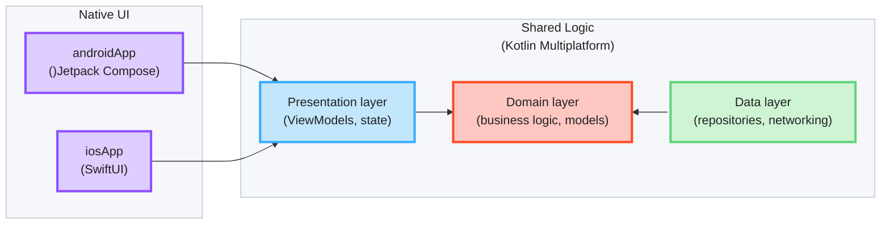

# KMP Showcase

A [Kotlin Multiplatform](https://www.jetbrains.com/help/kotlin-multiplatform-dev/get-started.html) sample application 
demonstrating how to share code for Android and iOS. Data, domain and presentation logic live in a common Kotlin module; 
the UI is native on each platform.

## Tech-Stack

Built with modern Android development tools and libraries, prioritizing, project structure stability,\
and production-readiness.

**Core Technologies:**

- [SKIE](https://skie.touchlab.co) - Kotlin native compiler plugin that that improves Kotlin-Swift interoperability 
(`Flow → AsyncSequence/Observing`, `sealed class → exhaustive Swift enum (onEnum(of:))`, `suspend → async`, default arguments, etc.)
- [KMP-ObservableViewModel](https://github.com/rickclephas/KMP-ObservableViewModel) - share Kotlin ViewModels 
  between Android and iOS while using native UI on each platform. Its main job is making Kotlin state changes 
  observable by SwiftUI and clear `viewModelScope` when the view goes away.
- [Ktor Resources](https://ktor.io/docs/client-resources.html) - type-safe HTTP requests. A `@Resource` request class
  (e.g. `ForecastRequestModel`) is serialized into the URL path and query parameters, so no manual `append(...)`.

## Architecture



* [/iosApp](./iosApp/iosApp) contains an iOS application. Even if you’re sharing your UI with Compose Multiplatform,
  you need this entry point for your iOS app. Feature SwiftUI code lives in the feature modules (see below).

* [/feature/forecast](./feature/forecast/src) is the forecast feature shared between app targets in the project.
  The most important subfolder is [commonMain](./feature/forecast/src/commonMain/kotlin).
  [androidMain](./feature/forecast/src/androidMain/kotlin) holds the Jetpack Compose UI in the [presentation](./feature/forecast/src/androidMain/kotlin/com/igorwojda/showcase/presentation) package (`ForecastScreen`, `ForecastDayScreen`).
  [iosMain/swift](./feature/forecast/src/iosMain/swift) holds the SwiftUI UI in the same `presentation` layout
  (see [Feature UI Lives in the Feature Module](#feature-ui-lives-in-the-feature-module)).

* [/feature/base](./feature/base/src) holds code shared by all feature modules, e.g. `StoreViewModel`.

* [/sharedUI](./sharedUI/src) is for code that will be shared across your Compose Multiplatform applications.
  It contains several subfolders:
  - [commonMain](./sharedUI/src/commonMain/kotlin) is for code that’s common for all targets.
  - Other folders are for Kotlin code that will be compiled for only the platform indicated in the folder name.
    For example, if you want to use Apple’s CoreCrypto for the iOS part of your Kotlin app,
    the [iosMain](./sharedUI/src/iosMain/kotlin) folder would be the right place for such calls.
    Similarly, if you want to edit the Desktop (JVM) specific part, the [jvmMain](./sharedUI/src/jvmMain/kotlin)
    folder is the appropriate location.

## Design Decisions

### Consuming Common ViewModels

ViewModels extend [`StoreViewModel`](./feature/base/src/commonMain/kotlin/com/igorwojda/showcase/feature/base/presentation/flowmvi/StoreViewModel.kt),
which owns a FlowMVI `store` (built with [`configuredStore`](#shared-store-setup)). Each platform consumes it through a different API:

| Consumer | State                                                    | Actions | Intents |
|----------|----------------------------------------------------------|---------|---------|
| Android (Compose) | `val state by viewModel.store.subscribe { action -> … }` | same `subscribe` lambda | `store.intent(…)` |
| iOS (SwiftUI) | `viewModel.states`                                       | `viewModel.actions` | `viewModel.onIntent(intent:)` |

iOS can't use `store` directly - `Store` is a Kotlin interface, exported to Swift as an Objective-C
protocol, and protocols lose their generic types. Swift would see `store.states` untyped and
`store.intent` accepting any `MVIIntent`. `StoreViewModel` re-exposes the store with concrete types:

- `states`: typed `StateFlow`; SKIE turns it into an `AsyncSequence` for `Observing`. Collecting it opens a
  store subscription, which lives as long as the view observes it.
- `actions`: a cold `Flow`, also backed by a store subscription. The subscription lives as long as
  the Swift `.task` that collects it, so `ActionShareBehavior.Distribute` sees the screen arrive and leave.
- `onIntent`: accepts only the screen's own intent type.

Both flows read the store through FlowMVI's `subscribe`, like the Compose `subscribe` does. The store's own
`states` property is internal FlowMVI API (`@InternalFlowMVIAPI`), and reading it doesn't register a subscriber, so
plugins such as `whileSubscribed` wouldn't see a screen that only renders state.

Android should keep using `store`, which ties the subscription to the Compose lifecycle.

FlowMVI has no official SwiftUI integration (its docs cover iOS only through Compose Multiplatform), hence this
bridge. Its experimental `NativeStore` (callbacks, manual `close()`) isn't used: SKIE flows are cancelled
automatically with the SwiftUI task.

**Trade-off:** a screen that collects both flows holds two subscriptions. That's fine with the default
`ActionShareBehavior.Distribute`, but `ActionShareBehavior.Restrict` (one subscription per store) would throw.

### Shared Store Setup

Every store is built with
[`configuredStore`](./feature/base/src/commonMain/kotlin/com/igorwojda/showcase/feature/base/presentation/flowmvi/ConfiguredStore.kt)
instead of FlowMVI's `store`. It launches the store in `viewModelScope`, sets `name` and `debuggable`, and installs
logging and [remote debugging](#debugging-flowmvi). The ViewModel adds only its own plugins:

```kotlin
override val store = configuredStore(initial = ForecastState.Loading, name = "Forecast") {
    recover { … }
    init { … }
    reduce { … }
}
```

- **One place for cross-cutting setup.** A new ViewModel can't forget logging or debugging, and a change (e.g. an
  extra plugin) happens once instead of in every ViewModel.
- **Only non-default config is set.** FlowMVI defaults (e.g. `ActionShareBehavior.Distribute`) aren't repeated.
- **Custom builder over a base-class hook.** A plain extension on `StoreViewModel` wraps FlowMVI's `store` DSL
  without changing it, so ViewModels still use the standard plugins (`init`, `reduce`, `recover`).

**Known issue:** `debuggable` is hardcoded to `true`, so logging and remote debugging also run in release builds. The
fix is to take a debug flag from the app and install both only when it's set. `enableRemoteDebugging` throws on
a non-debuggable store, so both must change together.

### Convention Plugins

Shared Gradle setup for the app and KMP modules lives in [build-logic](./build-logic/convention/src/main/kotlin), so each
module's build script only declares what's specific to it:

| Plugin | Class | Used by | Adds |
|--------|-------|---------|------|
| `showcase.android.application` | [`AndroidApplicationConventionPlugin`](./build-logic/convention/src/main/kotlin/AndroidApplicationConventionPlugin.kt) | `:androidApp` | Android application + Compose compiler plugins, `compileSdk` / `minSdk` / `targetSdk`, JVM target, release build type, all app dependencies (`:feature:forecast`, Jetpack Compose, lifecycle, Navigation 3, `koin-androidx-compose`) |
| `showcase.kmp.basefeature` | [`KmpBaseFeatureConventionPlugin`](./build-logic/convention/src/main/kotlin/KmpBaseFeatureConventionPlugin.kt) | `:feature:base` | KMP + Android-KMP library plugins, `iosArm64` / `iosSimulatorArm64` targets, Android `compileSdk` / `minSdk` / JVM target |
| `showcase.kmp.feature` | [`KmpFeatureConventionPlugin`](./build-logic/convention/src/main/kotlin/KmpFeatureConventionPlugin.kt) | every `:feature:*` module | everything above, plus `api(project(":feature:base"))`, Compose compiler and Jetpack Compose + `koin-androidx-compose` in `androidMain`, SKIE (Swift bundling off, SwiftUI `Observing` on) |

- The Android namespace is derived from the module path: `:feature:forecast` → `com.igorwojda.showcase.feature.forecast`.
- Versions come from the shared [version catalog](./gradle/libs.versions.toml), which `build-logic` reads too.
- A new feature module needs only `alias(libs.plugins.showcase.kmp.feature)` plus its own dependencies.

### Feature UI Lives in the Feature Module

A feature's native UI sits next to its shared logic, in the feature module, not in the app modules. The app
modules only wire things together: entry point, DI start-up and navigation.

```
feature/forecast/src/
├── commonMain/kotlin/…/presentation/   ViewModels, state (shared)
├── androidMain/kotlin/…/presentation/  Jetpack Compose screens and components
└── iosMain/swift/presentation/         SwiftUI screens and components
```

- **One package for all view code.** Screens, components and UI helpers go under `presentation`
  (`presentation/<feature>`, shared helpers in `presentation/common`), on both platforms. There is no `ui` package.
- **Android** is a normal KMP `androidMain` source set. The Compose compiler and Compose dependencies come from the
  `showcase.kmp.feature` [convention plugin](#convention-plugins), so feature build scripts don't repeat them.
- **iOS** Swift can't be compiled by Gradle, so the files are compiled by the Xcode app target through a
  synchronized folder (`forecast` in `iosApp.xcodeproj`, pointing at `feature/forecast/src/iosMain/swift`). New files
  there are picked up automatically.
- **SKIE Swift bundling is disabled** (`swiftBundling { enabled = false }` in the `showcase.kmp.feature` convention plugin). SKIE would otherwise compile
  `src/iosMain/swift` into the Kotlin framework, where the Swift packages the screens import
  (`KMPObservableViewModelSwiftUI`) aren't available. After changing this, run `./gradlew :feature:forecast:clean`,
  or SKIE reuses stale unpacked Swift sources.

**Trade-off:** the module owns its iOS UI files but not their build. Xcode compiles them, so an iOS-only
UI change still needs an Xcode build to verify.

### Navigation

Navigation is native on each platform and stays out of shared code. Shared ViewModels don't know about
routes or screens; a screen reports a user event through a callback (`onDayClick`), and the platform's
UI layer decides where to go.

| Platform | Library | Back stack | ViewModel lifetime |
|----------|---------|------------|--------------------|
| Android | [Navigation 3](https://developer.android.com/guide/navigation/navigation-3) | `rememberNavBackStack` of `@Serializable` `NavKey` routes in [`App`](./androidApp/src/main/kotlin/com/igorwojda/showcase/App.kt) | scoped to the back stack entry (`rememberViewModelStoreNavEntryDecorator`) |
| iOS | SwiftUI `NavigationStack` | `NavigationLink(value: day.date)` + `.navigationDestination(for: LocalDate.self)` in `ForecastScreen` | owned by the destination view (`@StateViewModel`) |

- **Routes carry IDs, not data.** `ForecastDayRoute` holds only the `LocalDate`. `ForecastDayViewModel` gets it as
  a Koin parameter (`parametersOf(date)`; on iOS `provideForecastDayViewModel(date:)`) and reads the day from the
  repository cache (see [Caching](#caching)). Routes stay small enough to save and restore, and the screen can
  load its own data on its own, e.g. after process death.
- **One ViewModel per destination.** Each opened day gets its own `ForecastDayViewModel`, which is cleared when
  the screen is popped, on both platforms.

## Dependency Injection

[Koin](https://insert-koin.io) wires the graph. All definitions live in shared code
([`sharedLogicModule`](./feature/forecast/src/commonMain/kotlin/com/igorwojda/showcase/di/SharedLogicModule.kt)),
so both platforms resolve the same instances:

- Android: `ShowcaseApplication.onCreate()` calls `initializeKoin { androidLogger(); androidContext(...) }`;
  composables get their ViewModel with `koinViewModel()`.
- iOS: `KMPShowcaseApplication.init()` calls `doInitKoin(config: nil)` — SKIE exposes the top-level
  Kotlin `initKoin` as a top-level Swift function. Swift can't use Koin's reified `get()`,
  so each resolved type gets an explicit accessor in
  [`Koin.ios.kt`](./feature/forecast/src/iosMain/kotlin/com/igorwojda/showcase/di/Koin.ios.kt).


## Caching

[`ForecastRepository`](./feature/forecast/src/commonMain/kotlin/com/igorwojda/showcase/data/ForecastRepository.kt)
keeps downloaded forecasts in an in-memory cache (per request parameters, guarded by a `Mutex`). The first request
hits the network; `ForecastDayViewModel` then reads the day from the cache. `ForecastIntent.Reload` bypasses the cache
(`forceRefresh = true`) and replaces the cached value. Entries expire after 15 minutes (wall clock) and are
re-downloaded on the next request; the cache itself lives as long as the process.

## Naming Conventions

### Screens vs Components.

UI types are named by role, consistently on both platforms:

- **`…Screen`** — a full destination the user navigates to. Owns its root state
  (a ViewModel), takes no state from a parent, and appears in the routing layer.
  `ForecastScreen` and `ForecastDayScreen` on both platforms.
- **`…Content`** — the stateless body of a screen, rendered for its loaded state and kept in the
  screen's file (`ForecastContent`, `ForecastDayContent`, shared `ErrorContent`).
- **Everything else** — reusable parts and leaf components, named after what they are
  (`CurrentWeatherCard`, `TemperatureRangeBar`), one per file. They take values from a parent and own
  no root state. The same name is used on both platforms.

On the iOS side this deviates from Apple's idiom, where every view type is suffixed
`View` (`ContentView`, `SettingsView`) regardless of scope. The deviation is deliberate:
it keeps vocabulary aligned across the two platforms, and makes "is this navigable?"
answerable from the type name instead of only from ViewModel ownership and folder
placement. Apply it to every destination without exception.

## Running the apps

Open project in [Android Studio](https://developer.android.com/studio), select platform and run the applicaiton.

## Running tests

Use the run button in your IDE's editor gutter, or run tests using Gradle tasks:

- Android tests: `./gradlew :sharedUI:testAndroidHostTest :feature:forecast:testAndroidHostTest`
- iOS tests: `./gradlew :feature:forecast:iosSimulatorArm64Test`

## Debugging FlowMVI

[FlowMVI](https://github.com/respawn-llc/FlowMVI) 
provides [Remote Debugging](https://opensource.respawn.pro/FlowMVI/plugins/debugging).

In this project remote debugging host is set to `"127.0.0.1"` ip address (`enableRemoteDebugging(host = "127.0.0.1")` in `configuredStore`). 
To make debugging work on Android physical device run `adb reverse tcp:9684 tcp:9684` command.
