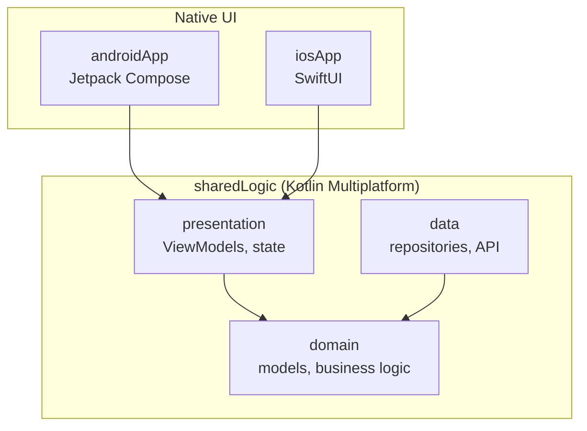

# KMP Showcase

A Kotlin Multiplatform sample app for Android and iOS. Data, domain and presentation logic live in
a shared Kotlin module (multiplatform); the UI is native on each platform — Jetpack Compose on Android, SwiftUI on iOS.

* [/iosApp](./iosApp/iosApp) contains an iOS application. Even if you’re sharing your UI with Compose Multiplatform,
  you need this entry point for your iOS app. This is also where you should add SwiftUI code for your project.

* [/sharedLogic](./sharedLogic/src) is for the code that will be shared between app targets in the project.
  The most important subfolder is [commonMain](./sharedLogic/src/commonMain/kotlin). If preferred, you
  can add code to the platform-specific folders here too.

* [/sharedUI](./sharedUI/src) is for code that will be shared across your Compose Multiplatform applications.
  It contains several subfolders:
  - [commonMain](./sharedUI/src/commonMain/kotlin) is for code that’s common for all targets.
  - Other folders are for Kotlin code that will be compiled for only the platform indicated in the folder name.
    For example, if you want to use Apple’s CoreCrypto for the iOS part of your Kotlin app,
    the [iosMain](./sharedUI/src/iosMain/kotlin) folder would be the right place for such calls.
    Similarly, if you want to edit the Desktop (JVM) specific part, the [jvmMain](./sharedUI/src/jvmMain/kotlin)
    folder is the appropriate location.

### Running the apps

Use the run configurations provided by the run widget in your IDE's toolbar. You can also use these commands and options:

- Android app: `./gradlew :androidApp:assembleDebug`
- iOS app: open the [/iosApp](./iosApp) directory in Xcode and run it from there.

### Running tests

Use the run button in your IDE's editor gutter, or run tests using Gradle tasks:

- Android tests: `./gradlew :sharedUI:testAndroidHostTest :sharedLogic:testAndroidHostTest`
- iOS tests: `./gradlew :sharedLogic:iosSimulatorArm64Test`

### Debugging FlowMVI

[FlowMVI](https://github.com/respawn-llc/FlowMVI) 
provides [Remote Debugging](https://opensource.respawn.pro/FlowMVI/plugins/debugging).

In this project remote debugging host is set to `"127.0.0.1"` ip address (`enableRemoteDebugging(host = "127.0.0.1")`). 
To make debugging work on Android physical device run `adb reverse tcp:9684 tcp:9684` command.

### Dependency injection

[Koin](https://insert-koin.io) wires the graph. All definitions live in shared code
([`sharedLogicModule`](./sharedLogic/src/commonMain/kotlin/com/igorwojda/showcase/di/SharedLogicModule.kt)),
so both platforms resolve the same instances:

- Android: `ShowcaseApplication.onCreate()` calls `initKoin { androidLogger(); androidContext(...) }`;
  composables get their ViewModel with `koinViewModel()`.
- iOS: `iOSApp.init()` calls `KoinIosKt.doInitKoinIos()`. Swift can't use Koin's reified `get()`,
  so each resolved type gets an explicit accessor in
  [`KoinIos.kt`](./sharedLogic/src/iosMain/kotlin/com/igorwojda/showcase/di/KoinIos.kt).

### Conventions

## Screens vs Components.

UI types are named by role, consistently on both platforms:

- **`…Screen`** — a full destination the user navigates to. Owns its root state
  (a ViewModel), takes no state from a parent, and appears in the routing layer.
  SwiftUI: `ForecastScreen`. Compose: `ForecastScreenFlowMvi`.
- **Everything else** — reusable parts and leaf components, named after what they are
  (`ForecastHeaderView`, `TemperatureBadge`). They take values from a parent and own
  no root state.

On the iOS side this deviates from Apple's idiom, where every view type is suffixed
`View` (`ContentView`, `SettingsView`) regardless of scope. The deviation is deliberate:
it keeps vocabulary aligned across the two platforms, and makes "is this navigable?"
answerable from the type name instead of only from ViewModel ownership and folder
placement. Apply it to every destination without exception.

---

Learn more about [Kotlin Multiplatform](https://www.jetbrains.com/help/kotlin-multiplatform-dev/get-started.html)…
