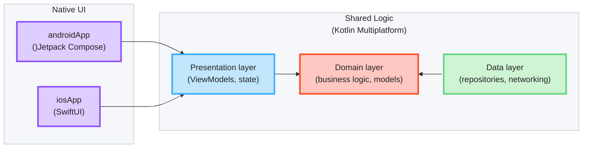

# KMP Showcase

A [Kotlin Multiplatform](https://www.jetbrains.com/help/kotlin-multiplatform-dev/get-started.html) sample application 
demonstrating how to share code for Android and iOS. Data, domain and presentation logic live in a common Kotlin module; 
the UI is native on each platform.

## Tech-Stack

Built with modern Android development tools and libraries, prioritizing, project structure stability,\
and production-readiness.

**Core Technologies:** 
- [SKIE](https://skie.touchlab.co) - Kotlin native compiler plugin that that improves Kotlin-Swift interoperability 
(`Flow → AsyncSequence/Observing`, `sealed class → exhaustive Swift enum (onEnum(of:))`, `suspend → async`, default arguments, etc.)
- [KMP-ObservableViewModel](https://github.com/rickclephas/KMP-ObservableViewModel) - share Kotlin ViewModels 
  between Android and iOS while using native UI on each platform. Its main job is making Kotlin state changes 
  observable by SwiftUI and clear `viewModelScope` when the view goes away.

## Architecture

* [/iosApp](./iosApp/iosApp) contains an iOS application. Even if you’re sharing your UI with Compose Multiplatform,
  you need this entry point for your iOS app. This is also where you should add SwiftUI code for your project.

* [/sharedLogic](./sharedLogic/src) is for the code that will be shared between app targets in the project.
  The most important subfolder is [commonMain](./sharedLogic/src/commonMain/kotlin). If preferred, you
  can add code to the platform-specific folders here too.

* [/sharedUI](./sharedUI/src) is for code that will be shared across your Compose Multiplatform applications.
  It contains several subfolders:
  - [commonMain](./sharedUI/src/commonMain/kotlin) is for code that’s common for all targets.
  - Other folders are for Kotlin code that will be compiled for only the platform indicated in the folder name.
    For example, if you want to use Apple’s CoreCrypto for the iOS part of your Kotlin app,
    the [iosMain](./sharedUI/src/iosMain/kotlin) folder would be the right place for such calls.
    Similarly, if you want to edit the Desktop (JVM) specific part, the [jvmMain](./sharedUI/src/jvmMain/kotlin)
    folder is the appropriate location.

## Design Decisions

### Consuming Common ViewModels

ViewModels extend [`StoreViewModel`](./sharedLogic/src/commonMain/kotlin/com/igorwojda/showcase/presentation/forecast/StoreViewModel.kt),
which owns a FlowMVI `store`. Each platform consumes it through a different API:

| Consumer | State                                                    | Actions | Intents |
|----------|----------------------------------------------------------|---------|---------|
| Android (Compose) | `val state by viewModel.store.subscribe { action -> … }` | same `subscribe` lambda | `store.intent(…)` |
| iOS (SwiftUI) | `viewModel.states`                                       | `viewModel.actions` | `viewModel.sendIntent(intent:)` |

iOS can't use `store` directly - `Store` is a Kotlin interface, exported to Swift as an Objective-C
protocol, and protocols lose their generic types. Swift would see `store.states` untyped and
`store.intent` accepting any `MVIIntent`. `StoreViewModel` re-exposes the store with concrete types:

- `states`: typed `StateFlow`; SKIE turns it into an `AsyncSequence` for `Observing`.
- `actions`: a cold `Flow` backed by a real store subscription. The subscription lives as long as
  the Swift `.task` that collects it, so `ActionShareBehavior.Distribute` sees the screen arrive and leave.
- `sendIntent`: accepts only the screen's own intent type.

Android should keep using `store`, which ties the subscription to the Compose lifecycle.

## Dependency Injection

[Koin](https://insert-koin.io) wires the graph. All definitions live in shared code
([`sharedLogicModule`](./sharedLogic/src/commonMain/kotlin/com/igorwojda/showcase/di/SharedLogicModule.kt)),
so both platforms resolve the same instances:

- Android: `ShowcaseApplication.onCreate()` calls `initializeKoin { androidLogger(); androidContext(...) }`;
  composables get their ViewModel with `koinViewModel()`.
- iOS: `KMPShowcaseApplication.init()` calls `doInitKoin(config: nil)` — SKIE exposes the top-level
  Kotlin `initKoin` as a top-level Swift function. Swift can't use Koin's reified `get()`,
  so each resolved type gets an explicit accessor in
  [`Koin.ios.kt`](./sharedLogic/src/iosMain/kotlin/com/igorwojda/showcase/di/Koin.ios.kt).

## Naming Conventions

### Screens vs Components.

UI types are named by role, consistently on both platforms:

- **`…Screen`** — a full destination the user navigates to. Owns its root state
  (a ViewModel), takes no state from a parent, and appears in the routing layer.
  SwiftUI: `ForecastScreen`. Compose: `ForecastScreenFlowMvi`.
- **Everything else** — reusable parts and leaf components, named after what they are
  (`ForecastHeaderView`, `TemperatureBadge`). They take values from a parent and own
  no root state.

On the iOS side this deviates from Apple's idiom, where every view type is suffixed
`View` (`ContentView`, `SettingsView`) regardless of scope. The deviation is deliberate:
it keeps vocabulary aligned across the two platforms, and makes "is this navigable?"
answerable from the type name instead of only from ViewModel ownership and folder
placement. Apply it to every destination without exception.

## Running the apps

Open project in [Android Studio](https://developer.android.com/studio), select platform and run the applicaiton.

## Running tests

Use the run button in your IDE's editor gutter, or run tests using Gradle tasks:

- Android tests: `./gradlew :sharedUI:testAndroidHostTest :sharedLogic:testAndroidHostTest`
- iOS tests: `./gradlew :sharedLogic:iosSimulatorArm64Test`

## Debugging FlowMVI

[FlowMVI](https://github.com/respawn-llc/FlowMVI) 
provides [Remote Debugging](https://opensource.respawn.pro/FlowMVI/plugins/debugging).

In this project remote debugging host is set to `"127.0.0.1"` ip address (`enableRemoteDebugging(host = "127.0.0.1")`). 
To make debugging work on Android physical device run `adb reverse tcp:9684 tcp:9684` command.
